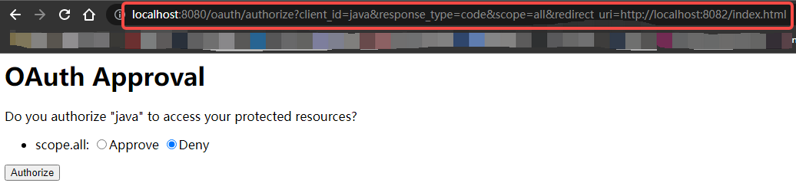

[OAuth2.0示例程序之授权码登录](https://mp.weixin.qq.com/s/GXMQI59U6uzmS-C0WQ5iUw)
--

服务器准备

项目 | 端口 | 备注
----|------|-----
[aco-auth-server](aco-auth-server)|8080|授权服务器
[aco-user-server](aco-user-server)|8081|资源服务器
[aco-client-app](aco-client-app)|8082|第三方应用

授权登录的过程：
* 用户在[第三方应用](aco-client-app)上访问页面： http://localhost:8082/index.html  

* 点击`第三方登录`，跳转到 [授权服务](aco-auth-server) 的登录页面  

* 登录后跳转到授权验证页面，其URL地址包含跳转的链接：http://localhost:8080/oauth/authorize?client_id=java&response_type=code&scope=all&redirect_uri=http://localhost:8082/index.html   

* 选择 Approval，跳转到 [第三方应用](aco-client-app) 的首页  
